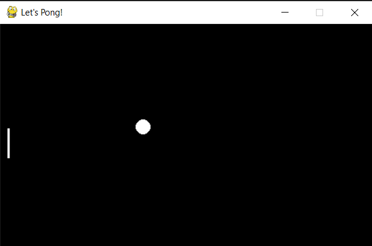

# Pong Game

## Description
For this project I've built a single player version of Pong, one of the first arcade video games (1972) using Python and PyGame.

## Prerequisites
- Python (v3.9.0) or newer
- pyGame (v2.4.0)

## Installation
```
- Download the latest python interpreter from python.org and install in the root directory.
- Set environment variable to point to location of python.exe. 
- Install pyGame using the following command: pip install pygame
- Open a terminal and issue the following command to run the pong.py script:

python pong.py

Or

<Full path to python.exe> pong.py

```

## Image
The output of running the program should have the following form:

### Pong Game





## Author
Uchenna Obicheta: [GitHub Profile](https://github.com/uobie80)